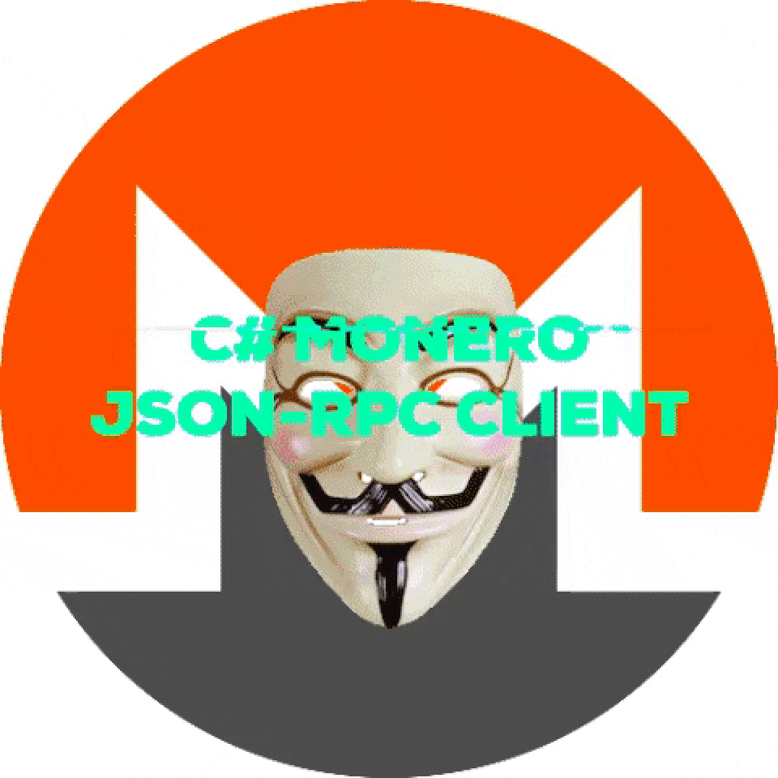
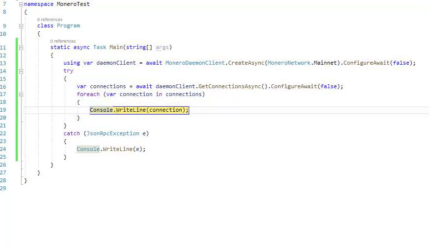

&nbsp;&nbsp;&nbsp;&nbsp;&nbsp;&nbsp;&nbsp;&nbsp;&nbsp;&nbsp;&nbsp;&nbsp;&nbsp;&nbsp;&nbsp;&nbsp;&nbsp;&nbsp;&nbsp;&nbsp;&nbsp;&nbsp;&nbsp;&nbsp;&nbsp;&nbsp;&nbsp;&nbsp;&nbsp;&nbsp;&nbsp;&nbsp;&nbsp;&nbsp;&nbsp;&nbsp;&nbsp;&nbsp;&nbsp;&nbsp;&nbsp;&nbsp;&nbsp;&nbsp;&nbsp;&nbsp; [](https://travis-ci.com/Agorist-Action/csharp-monero-rpc-client)  [](https://www.nuget.org/packages/Monero.Client/)

This is the source code of a Monero JSON-RPC client (for both daemon and wallet) built on .netstandard2.1.

# Basic Overview
Both a daemon client and wallet client are available. The daemon client interacts with `monerod.exe`, and the wallet client interacts with `monero-wallet-rpc.exe`
## MoneroDaemonClient
**Initialize Client**
```csharp
using Monero.Client.Daemon;
var daemonClient = new MoneroDaemonClient(new Uri("http://127.0.0.1:18082/json_rpc"));
```
**Get Connections**
```csharp
var token = new CancellationToken();
List<Connection> connections = await daemonClient.GetConnectionsAsync(token).ConfigureAwait(false);
```

For the entire MoneroDaemonClient interface, please click [here](https://github.com/Agorist-Action/csharp-monero-rpc-client/blob/master/Daemon/IMoneroDaemonClient.cs).
## MoneroWalletClient
**Initialize Client**
```csharp
using Monero.Client.Network;
using Monero.Client.Wallet;
using Monero.Client.Wallet.POD;

var moneroWalletClient = new MoneroWalletClient(MoneroNetwork.Testnet);
```
**Open Wallet**
```csharp
await moneroWalletClient.OpenWalletAsync("new_wallet3", "banana").ConfigureAwait(false);
```
**Transfer Funds**
```csharp
var cts = new CancellationTokenSource();
var dA = new List<(string address, ulong amount)>() 
{ 
	("BfukYd1Dv5YDgkZDhffjmHb1SfzT7Wr1HNTYkyxEmfnXiGepCHgPiaWicRCLHpM2moVNWAxNEVKogU2w58fT", 1000ul),
	("SomeOtherMoneroAddress", 3233100ul),
};
var response = await moneroWalletClient.TransferAsync(dA, TransferPriority.Normal, cts.token).ConfigureAwait(false);
```
For the entire MoneroWalletClient interface, please click [here](https://github.com/Agorist-Action/csharp-monero-rpc-client/blob/master/Wallet/IMoneroWalletClient.cs).
**Note:** Unlike the Daemon Client, to perform any action with the Wallet Client, one must first either create a new wallet, or open an existing one (as shown above).
# Latest Stable Release
Available on Nuget [here](https://www.nuget.org/packages/Monero.Client/).
```
Install-Package Monero.Client -Version 1.0.1.2
```
# Latest Development Changes
```
git clone https://github.com/Agorist-Action/csharp-monero-rpc-client
```
# Contributing
All contributions are welcome. Please make sure your pull request include:

 - A detailed description of the issue.
 - A detailed description of your solution.
 - Make sure your commit messages are descriptive.

 # Donation
 If you found this library helpful, donations are appreciated.
89CkXKw3MQLXAinJz2eb8ohmGdDasGxun65ArenNuqXFfDSVbhiqpte4E2PQaxT4yPbsNSXkT4hR2QMFYQneZfBoCX19Wx2


 # Contact Me
 I only reply to PGP encrypted emails.
 ```
-----BEGIN PGP PUBLIC KEY BLOCK-----
Comment: User-ID:	Agorist Action <agorist-action@protonmail.com>
Comment: Expires:	11/20/2022 12:00 PM
Comment: Fingerprint:	894243FA90DB98CC206CC26AD549F2F8BD052E5F


mQGNBF+4F00BDADUDZK1jqA6ieIqVaIGOJYLeQvi6TbsAMzDLlo7O4rzsrx3zzFQ
0mSYUmHhJ54wjfH5rQAneHGJRH1koH3/s+lLmV8Xci0uytCHCgQ7q/eteXXowm2p
qxk9h6JPr3dgqqLfEApFR+lCGy91OPq7GheYFzmGRqSTjNULuNM69aV0UEKPhBTz
dPxJV2D2P/abwe7Z0Yl5UJDdp5lUmqxYm8a1ebQEyRLZUnpU1I6FYSUcw0qFcHdJ
5TdCiKgd08cZFkqD3OniPyWr+I5hwU2cPY1F8CTa1iWHsPaaWcC1W3pUSXDry2rf
nox5THGV+tLGNHL2G2tahjCcFByaki4VrDyBUmFJ2hCjW0uXZTrpb52C60S1bjxM
5CZVrudskWbX/+Uu+RUZHf8x+3AGf2C3BTDM6zkRgmsSciZnDEIZeooQQdQ30F1H
TTSuR4G+a+iSyC++Q8Gk2AKxciifQAQYzoY+bIx7tN/lFJe10Swq1utpu1yVW6Lt
plgxo3zrpBRFvWcAEQEAAbQuQWdvcmlzdCBBY3Rpb24gPGFnb3Jpc3QtYWN0aW9u
QHByb3Rvbm1haWwuY29tPokB1AQTAQgAPhYhBIlCQ/qQ25jMIGzCatVJ8vi9BS5f
BQJfuBdNAhsDBQkDwlPTBQsJCAcCBhUKCQgLAgQWAgMBAh4BAheAAAoJENVJ8vi9
BS5f36EL/3412eWhxG89xx4U5N4j5nuGxqgiz6j7exbiRe1fmh5kP5hh+alIbkTS
NrBRjIWltt6IbnNatT+F9nqYgI0fQbirR78ZnD4u5Qyn1ZgbZ3+4t/VYoddqiNgP
Lr0hYs4aggGyssXDVqdIhkbA6dTDJ5aoq0sRayGtK+F3vyNQhJQksYG//B3nPLDs
aDu8YY6isICPCst2mvj1f2cijiwjkPzTAcjTFthya998+J8dSOzrwSGvgC/rC10Y
8OVGhsIBOVuk7eYPxdCjs6gd0EALARKd+CqIFAH6/RHCL9hqEYmcA2LermpMOhA0
x9gTLhfF1gKC+GQNlSWIQfbRC2Xe7TDrI8NqJcNaFn/7udKRXyt0UbLSkz30QvgQ
+vchLvq4Tb8vnfi+MoIlDydZL444s8QmnRkMONSW8hTgnE4SADw91KCMDi51pDag
zDTvB/uf6HXq8CCfDBVDnD6iZFECQFXduae7LE5ikIJw9OVqs5DecHO52b7mUIj4
N24HBoyPZbkBjQRfuBdNAQwAozwv/6fKoa8EqXxRw+brQ7+BhxYkT9MtxxuEBNu4
abdNlnlK/Z93yn1qmXqkQQLH/Rj5Yh9YnXZaRMsvociLGMRGuwT3lnlbVldTNE67
YBitNo95AyWknrYEIp16nu7nRud0VcmtQm7l0jDZI3lzr3UE74lUf2JX8cAI/nj0
ij2i+YXwEmiFp4qzHS5rg3VXlTCIfdbmHYFN27oLFSrlx7cSvYnBBVTIIHTs8RWX
w4plUj2zBwsyCaAR8nwxbwlzA6z2XDWQDyB7DM7n8j8QlJD7q1SZx73+mwjjd9+j
zyRE6Bxqh9BrBxtdyINoqY2SGQFT82W6UXdwOTBQUYstM4wdofWfwHlQN703IERX
4SIiiMXzhtXBdpEsB53yl8LL8cT4XvD1kVAxGqpL2bot7H99941PixLdlDT7b6OF
F66O1Pk3txeLqUILM0fkKqZdRE1Wc+Ioh+KVFLXWUq8NRm4UhRdqZalBgXk4SVgw
+xTJAJbJvFyk1Ot6JrN52wFxABEBAAGJAbwEGAEIACYWIQSJQkP6kNuYzCBswmrV
SfL4vQUuXwUCX7gXTQIbDAUJA8JT0wAKCRDVSfL4vQUuX1P1C/9yp4R/Svx7TpdV
qnRZyuT9kwJ4AYr6DD0GJurZggzoh1SljiVcylk/6Dpc5etHSHTCwOJHHFEdozLE
5AWgCmZ4XLshh05ZL57evuBILlFiJXo/6naEIrSu8KcNSHIq4nvJ+TCwmb3NISNz
Md7KF/iTCBcW5kz/cOviHzYECUdBS+FInxf0uQINasAIsPcfV8V7u7LiIZNfb2JV
jqVKQhRKqB6aTamC3YZmPUwno7jDyZTbG7LrICFPWo+HZanw843ZwlHdMfp/XjKk
FqJ79s9dugfXqXm91ugLi0gAkDOBVDzxbnIq/V0lkCEo/LrHaXquwfa5axlPuZ2G
xajJVguGv0FdaXwhBpB4S4GozZfs4hA6C4ks7hlayzmZJGYmjM7rEP2uMS6534/b
+uZhAdwtKdP13TZGo2q57LqZRbUMIDU7fkvysq1lS/uFO5B8cq0vqRFZA4j7Hfmk
VMkDCDHIRUlPJKxOmeujauOYdIMpfdUKxa5cIGxiBWJApWBBX2Y=
=4ihe
-----END PGP PUBLIC KEY BLOCK-----
```
